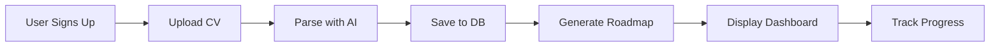

# 🆕 NEW FEATURE: Personalized Roadmap Generation

## ✨ ما الجديد؟

تم إضافة **Roadmap Generation API** - خدمة ذكاء اصطناعي لإنشاء خطط تعليمية مخصصة!

### 🎯 الوظيفة
- تحليل مستوى المستخدم الحالي (Junior/Mid-level)
- إنشاء roadmap مخصصة لمدة 3-6 شهور
- توضيح المهارات المطلوب تطويرها
- اقتراح مشاريع عملية مناسبة
- إنشاء Mermaid diagram للتصور البصري

---

## 🚀 كيفية الاستخدام

### 1. رفع CV أولاً
```bash
curl -X POST "http://localhost:8000/parse-cv?user_id=USER_ID" \
  -F "file=@cv.pdf"
```

### 2. إنشاء Roadmap
```bash
curl -X POST "http://localhost:8000/generate-roadmap/USER_ID"
```

### 3. النتيجة
```json
{
  "userId": "USER_ID",
  "roadmap_duration": "3-6 months",
  "roadmap": [
    {
      "phase": "Month 1",
      "focus": ["Skill A", "Skill B"],
      "topics": ["Topic 1", "Topic 2"],
      "projects": ["Project idea"]
    }
  ],
  "mermaid_code": "graph TD\n..."
}
```

---

## 📁 الملفات المضافة

### 1. Core Files
```
app/schemas/roadmap_schema.py       # Pydantic schemas
app/services/roadmap_service.py     # AI roadmap generation logic
```

### 2. API Updates
```
app/api/routes.py                   # Added POST /generate-roadmap/{user_id}
```

### 3. Documentation & Tests
```
ROADMAP_API_GUIDE.md               # شرح شامل بالعربية
test_roadmap.py                     # اختبارات شاملة
```

---

## 🔧 التثبيت والإعداد

### لا يوجد تغييرات على المتطلبات!
الـ feature الجديدة تستخدم نفس المكتبات الموجودة:
- ✅ Groq AI (موجود مسبقاً)
- ✅ FastAPI (موجود مسبقاً)
- ✅ Pydantic (موجود مسبقاً)

### فقط تأكد من:
```env
# .env
GROQ_API_KEY=your_key_here  # ضروري
```

---

## 📊 مثال عملي كامل

### Scenario: مستخدم جديد يرفع CV

```bash
# خطوة 1: رفع CV
curl -X POST "http://localhost:8000/parse-cv?user_id=ahmed-123" \
  -F "file=@ahmed_cv.pdf"

# خطوة 2: إنشاء roadmap مخصصة
curl -X POST "http://localhost:8000/generate-roadmap/ahmed-123" \
  > roadmap.json

# خطوة 3: عرض النتائج
cat roadmap.json | jq '.roadmap[] | .phase'
# "Month 1"
# "Month 2"
# "Month 3"
# ...
```

---

## 🎨 Integration Examples

### React Component
```jsx
function RoadmapGenerator({ userId }) {
  const [roadmap, setRoadmap] = useState(null);
  
  const generateRoadmap = async () => {
    const res = await fetch(`/api/generate-roadmap/${userId}`, {
      method: 'POST'
    });
    const data = await res.json();
    setRoadmap(data);
  };
  
  return (
    <div>
      <button onClick={generateRoadmap}>
        Generate My Roadmap
      </button>
      
      {roadmap && (
        <div>
          <h2>{roadmap.roadmap_duration}</h2>
          <div className="mermaid">
            {roadmap.mermaid_code}
          </div>
          
          {roadmap.roadmap.map(phase => (
            <PhaseCard key={phase.phase} {...phase} />
          ))}
        </div>
      )}
    </div>
  );
}
```

### .NET Controller
```csharp
[Authorize]
[HttpPost("my-roadmap")]
public async Task<IActionResult> GenerateMyRoadmap()
{
    var userId = User.FindFirstValue(ClaimTypes.NameIdentifier);
    
    var response = await _httpClient.PostAsync(
        $"http://python-api:8000/generate-roadmap/{userId}",
        null
    );
    
    if (!response.IsSuccessStatusCode)
    {
        return BadRequest("Failed to generate roadmap");
    }
    
    var roadmap = await response.Content
        .ReadFromJsonAsync<RoadmapResponse>();
    
    return Ok(roadmap);
}
```

---

## 🧪 Testing

### Run Tests
```bash
python test_roadmap.py
```

### Expected Output
```
🚀🚀🚀🚀🚀🚀🚀🚀🚀🚀🚀
ROADMAP GENERATION - TEST SUITE
🚀🚀🚀🚀🚀🚀🚀🚀🚀🚀🚀

✅ GROQ_API_KEY configured
✅ Using model: llama-3.3-70b-versatile

📊 User Data Summary:
   Name: Ahmed Elsayed
   Skills: 19 skills
   Experience: 0 entries
   Education: 1 entries

🤖 Calling AI to generate roadmap...
   (This may take 5-15 seconds)

✅ SUCCESS - Roadmap generated!
====================================
📅 Duration: 3-6 months
🎯 Total Phases: 5

...

✅ ALL TESTS PASSED!
💾 Sample output saved to: sample_roadmap_output.json
```

---

## 🤖 AI Model Used

### Default: `llama-3.3-70b-versatile` (Groq)

**Why this model?**
- ✅ **مجاني 100%** - بدون بطاقة ائتمان
- ✅ **سريع جداً** - Groq inference engine
- ✅ **دقيق** - 70B parameters
- ✅ **حد استخدام سخي** - 12K tokens/min

### Alternatives (كلها مجانية):
```env
GROQ_MODEL=llama-3.1-70b-versatile
GROQ_MODEL=mixtral-8x7b-32768
GROQ_MODEL=gemma2-9b-it
```

---

## 📖 Documentation

### الشرح الكامل
اقرأ **[ROADMAP_API_GUIDE.md](ROADMAP_API_GUIDE.md)** للحصول على:
- 📚 أمثلة تفصيلية بكل اللغات
- 🎨 طرق عرض Mermaid diagrams
- 🔐 Security best practices
- 🐛 Troubleshooting guide
- 🎯 Use cases عملية

### API Documentation
بعد تشغيل المشروع:
- **Swagger UI:** http://localhost:8000/docs
- **ReDoc:** http://localhost:8000/redoc

---

## 🎯 Use Cases

### 1. Career Dashboard
```
عند دخول المستخدم → عرض roadmap مخصصة
```

### 2. Skill Gap Analysis
```
مقارنة مع job requirements → تحديد المهارات الناقصة
```

### 3. Onboarding
```
مستخدم جديد → رفع CV → roadmap تلقائية
```

### 4. Progress Tracking
```
تتبع التقدم عبر الـ phases
```

---

## 🔄 Workflow Integration

### Recommended Flow


### Code Example
```python
# في .NET Backend
async def onboard_new_user(user_id: str, cv_file: IFormFile):
    # 1. Parse CV
    cv_data = await parse_cv(cv_file, user_id)
    
    # 2. Generate roadmap
    roadmap = await generate_roadmap(user_id)
    
    # 3. Save both to database
    await save_user_profile(user_id, cv_data, roadmap)
    
    # 4. Redirect to dashboard
    return redirect(f"/dashboard/{user_id}")
```

---

## ⚡ Performance

### Response Times
- **Parse CV:** 2-5 seconds
- **Generate Roadmap:** 5-15 seconds
- **Total:** ~7-20 seconds

### Optimization Tips
1. **Caching:** Cache roadmaps for 24 hours
2. **Async:** Use background jobs for long operations
3. **Database:** Add indexes on ApplicationUserId

---

## 🔐 Security

### Best Practices
```csharp
// في .NET - استخدم authenticated user
[Authorize]
[HttpPost("generate-roadmap")]
public async Task<IActionResult> GenerateRoadmap()
{
    // Use authenticated user ID, not from request
    var userId = User.FindFirstValue(ClaimTypes.NameIdentifier);
    // ...
}
```

### Rate Limiting
```python
# في FastAPI
from fastapi_limiter.depends import RateLimiter

@router.post(
    "/generate-roadmap/{user_id}",
    dependencies=[Depends(RateLimiter(times=5, hours=1))]
)
```

---

## 📝 Changelog

### Version 2.0.0 - Roadmap Feature

**Added:**
- ✅ POST `/generate-roadmap/{user_id}` endpoint
- ✅ AI-powered roadmap generation
- ✅ Mermaid diagram support
- ✅ Skill level assessment
- ✅ Project recommendations

**Changed:**
- 📝 Updated `routes.py` with new endpoint
- 📝 Added comprehensive documentation

**Technical:**
- 🔧 No new dependencies required
- 🔧 Uses existing Groq integration
- 🔧 Fully backward compatible

---

## 🆘 Support

### Common Issues

**Q: "GROQ_API_KEY not set"**
```bash
# A: Add to .env
echo "GROQ_API_KEY=gsk_your_key" >> .env
```

**Q: "User not found"**
```bash
# A: Upload CV first
curl -X POST "/parse-cv?user_id=xyz" -F "file=@cv.pdf"
```

**Q: "Roadmap seems generic"**
```
A: Ensure CV has detailed information:
   - Complete skills list
   - Detailed experience
   - Clear summary
```

---

## 🎓 Next Steps

### للمطورين
1. ✅ Test the endpoint: `python test_roadmap.py`
2. ✅ Read full docs: `ROADMAP_API_GUIDE.md`
3. ✅ Integrate with your frontend
4. ✅ Add to your .NET API

### للمستخدمين
1. Upload your CV
2. Generate your roadmap
3. Follow the plan
4. Track your progress

---

## 🎉 Summary

### ما تم إنجازه:
- ✅ AI-powered roadmap generation
- ✅ Integration with existing database
- ✅ Mermaid diagram support
- ✅ Comprehensive documentation
- ✅ Test suite included
- ✅ 100% FREE (no paid services)

### الملفات المضافة فقط:
```
app/schemas/roadmap_schema.py
app/services/roadmap_service.py
app/api/routes.py (updated)
ROADMAP_API_GUIDE.md
test_roadmap.py
NEW_FEATURES.md (this file)
```

### لا حاجة لـ:
- ❌ New dependencies
- ❌ Database migrations
- ❌ Environment changes (except GROQ_API_KEY)

---

**Ready to use! 🚀**

```bash
# Start the server
uvicorn app.main:app --reload

# Test it
curl -X POST "http://localhost:8000/generate-roadmap/USER_ID"
```

**Happy Learning! 🎓**
